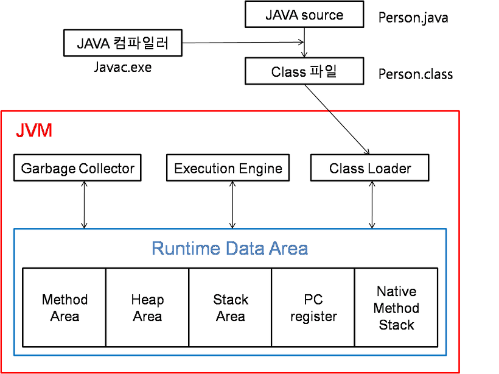

## JVM 밑바닥까지 파헤치기

### 2장 자바 메모리 영역과 메모리 오버플로

- 2장에서는 JVM 메모리 영역에 대한 상세한 설명과, 메모리 오버플로가 발생하는 경우에 대해서 설명한다.
  - 사실 메모리 영역에 대해서 이정도로 자세히 알 필요는 없을 것 같다. 예전 취준 때 GC 버전별 차이와 메모리 영역 등 달달 외웠었는데, 암기식 면접 외에는 도움이 되지 않았다고 생각한다.
  - 이번 장은 메모리 영역에 대한건 훑어보고, 그 중에서 더 궁금한건 더 찾아보고. OOM같은건 사내에서 발생한 사례를 찾아보고 원인 찾아보자.


#### 런타임 데이터 영역

- 스레드가 공유하는 데이터 영역: 메서드영역(런타임 상수 풀), 힙

- PC 레지스터: 스레드가 시작될 때 생성되며 스레드가 어떤 부분을 어떤 명령으로 실행할지 기록하는 부분
- 스택: 메서드 호출과 복귀에 따른 프레임을 저장하는 스택. 스레드의 메모리 모델을 설명하는 부분
- 네이티브 메서드 스택: 네이티브 메서드를 위한 스택
- 힙: 객체를 저장하는 공간. GC의 대상이 되는 영역
- 메서드 영역: 클래스 로더에 의해 로딩된 클래스 정보, 상수, 정적 변수 등을 저장하는 공간. 즉, 값이 잘 변하지 않는 것들을 저장하는 곳이다.


#### 책 내용에서 궁금했던 부분
```
자바 힙에서 현 관점에서 자바 언어가 계속 발전하면서 앞으로 값 타입도 지원할 것으로 보인다. 
당장만 생각하더라도 JIT컴파일 기술이 발전하면서, 특히 탈출 분석 기술이 날로 발전하면서 스택 할당과 스칼라 치환 최적화 방식이 살짝 달라졌다.
```
- 값타입이란? 
  - 지피티: 값 타입(Value Type)은 현재 자바에서 다루는 **참조 타입(Reference Type)**과 대조되는 개념으로, 값 자체를 복사하여 전달하고,별도의 객체 힙 할당이 필요 없는 타입을 말합니다. 이는 성능 최적화를 목표로 하는 개념으로, C와 같은 언어에서의 **구조체(struct)**와 비슷한 맥락입니다.
- 그럼 자바는 값타입을 쓰지 않고 참조 타입을 썼던 이유는 뭐야?
  - OOP를 하기 위함 등등의 설명이 나왔지만, 다시 찾아보니 값타입을 쓴다고 해서 다형성과 상속, OOP등을 못하는 것은 아니다.
  - 내 생각엔 자바가 타입을 참조타입으로 쓴 이유는 메모리 관리 때문이라고 생각한다. 참조 타입을 사용함으로서 메모리 관리를 GC한테 맡기고 싶어서 이지 않을까?
- 왜 값 타입(Value Type)이 다시 필요한가?
  - 지피티: 자바가 성능이나 메모리 효율성을 우선시하지 않고 참조 타입을 선택한 이유는 위와 같지만, 시간이 지나면서 대용량 데이터 처리나 높은 성능을 요구하는 경우가 늘어나게 되었습니다. 이러한 상황에서 객체의 힙 할당, 가비지 컬렉션의 오버헤드 등이 성능 병목으로 작용하기 시작했습니다.
- JIT 컴파일 기술이 발전하면서 스택할당과 스칼라치환 최적화 방식이 달라졌다는 뜻이 뭐지?
  - JIT 컴파일러의 탈출 분석(Escape Analysis)의 발전을 통해 참조 타입이 스레드를 벗어날 일이 없다면 스택 영역에 메모리를 할당하여 GC 스캔 대상 범위를 줄여준다고 한다.
  - 지피티: JIT 컴파일러의 탈출 분석 기술은 JDK 6부터 HotSpot 가상 머신에 도입되었습니다.
- 그럼 값타입이 왜 필요한가?


### 실전: OOM 예외가 발생하는 경우

#### 힙덤프, 스레드 덤프 분석툴
- 인텔리제이, 이클립스 MAT,


`- 문제를 분석할 때는 메모리 누수인지, 오버플로인지 확인한다.
  - 불필요한 객체가 원인이라면 메모리 누수`
  - 애플리케이션이 설정된 힙 메모리 용량을 초과하는 메모리 요청을 시도할 때.

- 스레드 덤프
  - 각 스레드 마다의 상태를 확인할 수 있다. 참고: https://steady-coding.tistory.com/597
  - 근데 Spring-MVC 사용하는 환경에서 핀포인트로 보는 것 외에 더 확인할게 있으려나,,? 요청당 하나의 스레드로 동작할거라, 볼 일이 있을까 싶다. 

[실제사례.md](실제사례.md)

참고: https://d2.naver.com/helloworld/1329, https://d2.naver.com/helloworld/37111
